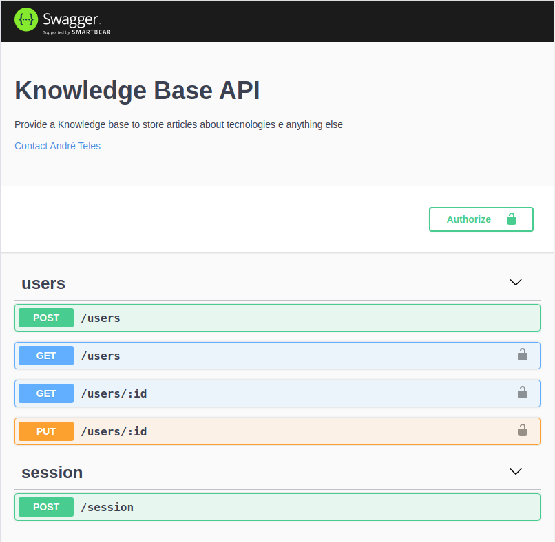

# Knowledge Base (BACKEND)

Knowledge Base API é um projeto prático desenvolvido no curso **Web Moderno Com Javascript** da [Udemy](https://www.udemy.com/) no qual é abordado a criação de uma base de conhecimento. No backend foi usado um [Skeleton Express](https://github.com/apteles/skeleton-express) para saber mais sobre a estrutura veja o repositório.

**Obs: Para ver o projeto Frontend criado para essa API veja o [Aqui](https://github.com/apteles/knowledge_base_frontend)**

# Funcionalidades!

- Administração de usuários.
- Administração de categorias.
- Administração de artigos/posts.
- Estatísticas gerada automáticamente.
  - Essa funcionalidade disponibiliza um endpoint para que o administrador consiga ter uma idéia
    de quantos usuário, artigos e categorias cadastrados na plataforma.
- Autenticação via token JWT e autorização.
- Paginação de dados

Você também pode acessar a documentação dos recursos [Aqui]().
Essa aplicação implementa os principais conceitos da Arquitetura REST e seus 5 principais requisitos para que seja considerado uma API [Restful](https://restfulapi.net/).

### Tecnologias

Esse projeto aplica as tecnologias mais comuns usadas no universo Nodejs, tais como:

- [Express]().
- [Bcrypt]().
- [Jsonwebtoken]().
- [Mongoose]().
- [Node Schedule]().
- [Sequelize]().
- [Yup]().
- [Swagger]().
- [Factory Girl]().
- [Faker]().
- [Jest]().
- [Sqlite3]().
- [Supertest]().

### Infraestrutura de Desenvolvimento

- [Docker]().
- [Docker Compose]().

### Produção

- [Docker Swarm](). (Em Breve)

## Executando o projeto

Com o `docker` e `docker-compose` instalado em sua máquina basta apenas executar o seguinte comando:

```sh
$ docker-compose up -d
```

Note que após executado o comando `docker ps` será listado 3 containers:

- backend_app_1 na porta `3333`
- backend_database_1 na porta `5432`
- backend_mongo_1 na porta `27017`

```sh
❯ docker ps
CONTAINER ID        IMAGE               COMMAND                  CREATED             STATUS                    PORTS                      NAMES
dba00d19ae11        backend_app         "/tini -- yarn dev"      20 hours ago        Up 48 minutes             0.0.0.0:3333->3333/tcp     backend_app_1
1d88a60b0a5a        postgres:12.3       "docker-entrypoint.s…"   20 hours ago        Up 49 minutes (healthy)   0.0.0.0:5432->5432/tcp     backend_database_1
8e5071e4e20f        mongo               "docker-entrypoint.s…"   20 hours ago        Up 49 minutes (healthy)   0.0.0.0:27017->27017/tcp   backend_mongo_1
```

**OBS:**
Pode ser necessário na primeira execução executar o comando `docker-compose build up` ao invés do comando `docker-compose up -d`

## Executando em produção.

Para executar essa aplicação em produção você gerar uma imagem a partir do `Dockerfile` existente nesse projeto.
Esse docker file foi criada em multi stage, uma feature do docker que permite escrever image com o máximo de reaproveitamento
de camadas. Para mais informações sobre essa feature veja [Docker Multi Stage](https://docs.docker.com/develop/develop-images/multistage-build/).
Exemplo de como gerar a imagem:

```sh
$ docker build -t ateles/knowledge-prod:v1.0.0 --target production . --no-cache
```

## Testes

Foi aplicado o minimo de cenários de testes para prevenir o mínimo de na aplicação. Veja uma exemplo
de como rodar os testes:

```sh
❯ yarn test
yarn run v1.21.1
$ NODE_ENV=test sequelize db:migrate

Sequelize CLI [Node: 14.4.0, CLI: 6.1.0, ORM: 6.2.3]

Loaded configuration file "src/config/database.js".
== 20200630193813-create-users: migrating =======
== 20200630193813-create-users: migrated (0.067s)

== 20200701132734-create-categories: migrating =======
== 20200701132734-create-categories: migrated (0.047s)

== 20200701165544-create-articles: migrating =======
== 20200701165544-create-articles: migrated (0.053s)

$ NODE_ENV=test jest
 PASS  __tests__/users.test.js
  Users
    ✓ should return a new user with password encrypted (205ms)
    ✓ should be able register a new user (153ms)
    ✓ should return error if user already exists and status 400 (87ms)
    ✓ should response with errors if body sent empty and status 400 (33ms)
    ✓ should return status 401 (14ms)

Test Suites: 1 passed, 1 total
Tests:       5 passed, 5 total
Snapshots:   0 total
Time:        4.491s
Ran all test suites.
$ NODE_ENV=test yarn sequelize db:migrate:undo:all
$ /home/andre/Code/github/knowledge/backend/node_modules/.bin/sequelize db:migrate:undo:all

Sequelize CLI [Node: 14.4.0, CLI: 6.1.0, ORM: 6.2.3]

Loaded configuration file "src/config/database.js".
== 20200701165544-create-articles: reverting =======
== 20200701165544-create-articles: reverted (0.059s)

== 20200701132734-create-categories: reverting =======
== 20200701132734-create-categories: reverted (0.062s)

== 20200630193813-create-users: reverting =======
== 20200630193813-create-users: reverted (0.059s)

Done in 9.76s.
```

## Ferramentas adicionais

Além do `prettier`, `eslint` também foi configurado o `rusky` para melhorar no processo de desenvolvimento. Um exemplo configurado
nesse projeto é quando um usuário implementa um feature no projeto e vai fazer o `commit` ou `push` é executado o `yarn lint` e `yarn test`, ou seja,
se o desenvolvedor efetuar um commit e não passar os testes ou o padrão de código o mesmo não será feito fazendo com que o desenvolvedor volte
e corrija.

```sh
❯ git commit -m "refacted validation"
husky > pre-commit (node v14.4.0)
$ eslint . --ext .js
$ NODE_ENV=test sequelize db:migrate

```

## Documentação da API

Foi usado o swagger para prover uma documentação mais clara possível dos recursos disponíveis nesse projeto. Para acessar basta acessar o
recurso `http://localhost:3333/docs`, após já ter executado o passo de **Executando o Projeto** mencionado nesse documento. Uma página semelhante a imagem abaixo será apresentada, veja:



## Licença


